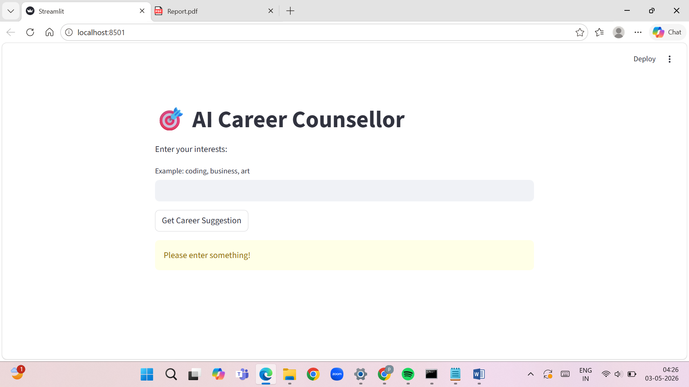
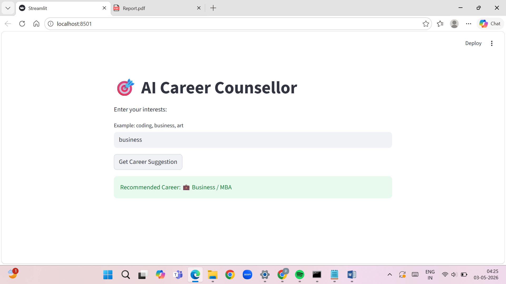
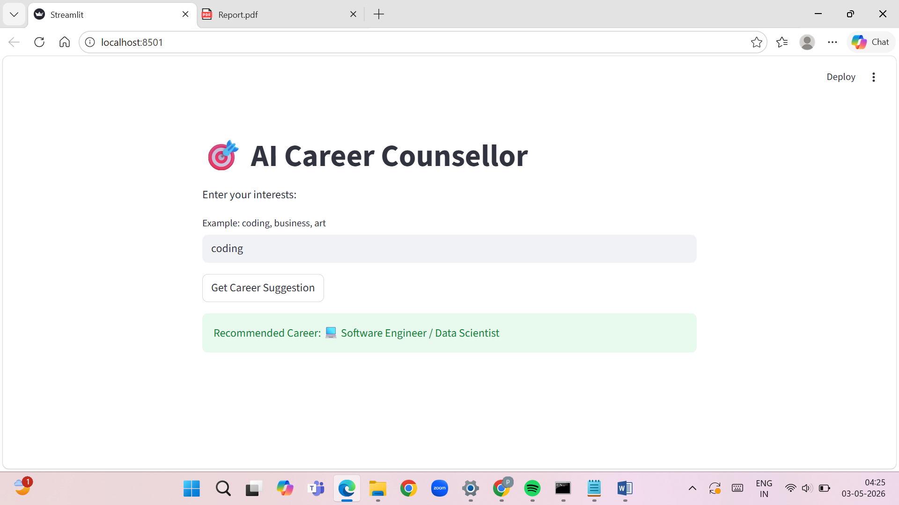

# 🎯 AI Career Counsellor

An AI-based system that recommends career options based on user interests using Machine Learning and NLP.

---

## 🚀 Features

* Predicts career based on user input
* Uses TF-IDF for text processing
* Logistic Regression model
* Interactive Streamlit UI

---

## 🛠️ Technologies Used

* Python
* Scikit-learn
* Streamlit
* Pandas

---

## 📊 How It Works

1. User enters interest (e.g., coding, business)
2. Text is processed using TF-IDF
3. Model predicts category
4. UI displays career suggestion

---

## ▶️ How to Run

```bash
pip install streamlit scikit-learn
python -m streamlit run app.py
```

---

## 📸 Screenshots




---

## 💡 Example

Input: business
Output: Business / MBA

---

## 📌 Project Type

Intermediate Machine Learning Project

